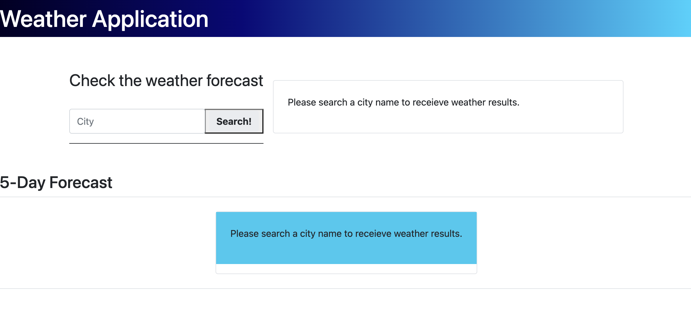

# WeatherWizard
A weather prediction application for a simple and polished user

## Description

The intention of this website is create a simple weather prediction application. To do this I pulled from the OpenWeather API twice, once to get today's weather, and again to get the next 5 days. To create this application, I used a combination of bootstrap, dayjs, jquery, javascript, and getting a much better understanding of local storage so the user can re-click a previous search option. 

## Usage

Screenshots were included below of the site. The site images are saved locally and a screenshot is shown below.

A GitHub link is here: https://github.com/caseyfee/WeatherWizard

Live link: https://caseyfee.github.io/WeatherWizard/

## Credits

Big thanks to my fellow students, MDN documentation, my tutor, and a most helpful MVP BCS helper this week - you know who you are!
